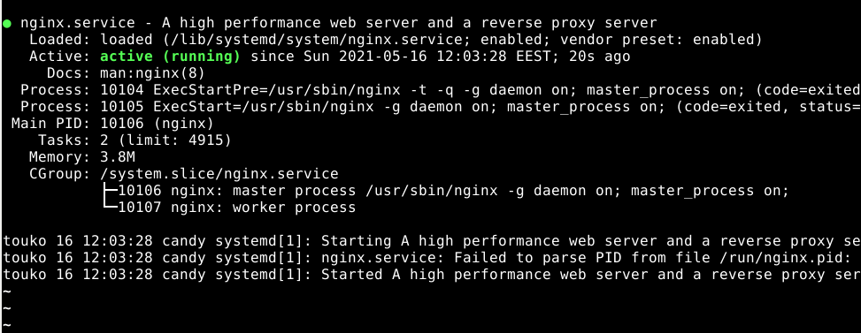
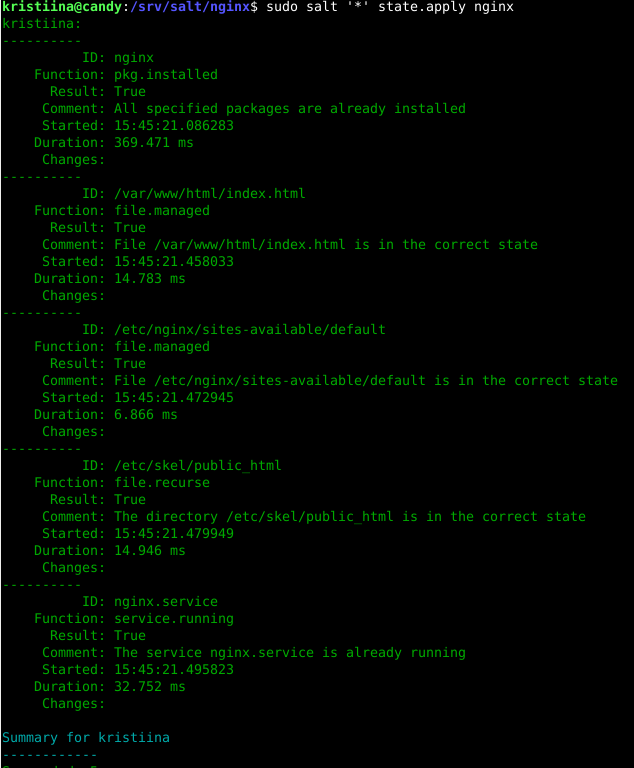
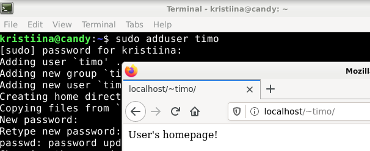
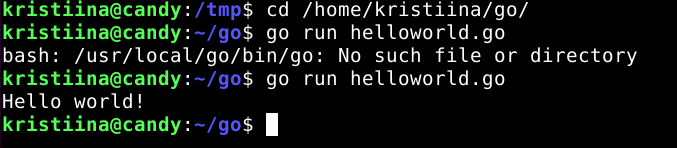

# Viikko 7 : Oma moduli

Tämä on viimeinen tehtäväpalautukseni ja lopputehtäväni kurssille:

[Palvelinten hallinta: ICT4TN022-3011](https://terokarvinen.com/2021/configuration-management-systems-palvelinten-hallinta-ict4tn022-spring-2021/?fromSearch=),

Opettaja: Tero Karvinen

----------------

Tarkoituksenani oli luoda tila, joka julkaisisi Android-sovelluksen helposti puhelimelle. Tehtävä osoittautuikin yllättävän hankalaksi, joten päätin tehdä varasuunnitelmani.

Tehtävä löytyy Githubista https://github.com/kri-ku/my_first_salt.

Asensin ohjelmat, joiden pohjana on idea LAMP-stackista.

Valitsin seuraavat ohjelmat:

- Palvelin: Nginx
- Palomuuri: UFW
- Tietokanta: MariaDB
- Ohjelmointikieli: Go

Olen tyytyväinen lopputulokseen. Moduli toimii halutusti: se on idempotentti, ja ohjelmat asentuvat haluamillani ominaisuuksilla.

Edit ti:
Jos jotain opin niin, että Salt on haastava työkalu ja vaatisi paljon opiskelua lisää. Luulin saaneeni modulit hyvin kasaan, mutta kokeiltuani niitä tyhjällä virtuaalikoneella, oli asetuksiin jäänyt kuitenkin paljon ongelmia. Kokeilin modulin asentamista pariin kertaan, ensimmäisellä kerralla Ufw asentui, toisella kerralla ei. Myös MariaDB:n ja GO:n asentamisessa ilmeni ongelmia. Olen raportoinut toisen testauskertani raportin loppuun.

-----

Asensin jokaisen ohjelman ensin käsin, jonka jälkeen muodostin ohjelman asentavan Salt-tilan.

Ajankulku hävisi täysin. Moduli on rakennettu useissa palasissa 15. -17-5-2021 eri kellonaikoina. 

-----
Ympäristö:
- Lenovo Thinkpad x270: Intel(R)Core i5-6200U AMD64_x86, 8 Gt, 128 Gt SSD
- Ubuntu 20.04: Tehtävät tehty Virtual Boxilla, jolla debian-live-10.7.0-amd64-xfce+nonfree.iso
- Salt master ja minion toimivat samalla virtuaalikoneella

Testasin modulin toimintaa vielä lopuksi uudella, tyhjällä debian-live-10.7.0-amd64-xfce+nonfree.iso- virtuaalikoneella.

-----

##  UFW

### Asennus manuaalisesti

Olin kokeillut palomuurin asentamista jo kotitehtävissä, mutta halusin kokeilla sen asentamista uudelleen.

    $ sudo apt-get update
    $ sudo apt-get install ufw

Otin aikajanan tiedostossa /etc komennolla `$ sudo find -printf "%T+%p\n" | sort`.
Kuvassa näkyvät ufw:hen liittyvät rivit:

Avasin portin 22 liikenteelle `$ sudo ufw allow 22/tcp` ja otin jälleen aikajanan:

### Asennus Saltilla

Aloitin Salt-modulin rakentamisen.
Loin kansion modulini pohjaksi tiedostoon /srv/salt.

    $ sudo mkdir /srv/salt/moduli
    $ sudoedit /srv/salt/moduli/init.sls

    install:
      pkg.installed:
        - pkgs:
          - ufw

Ajoin tilan paikallisesti komennolla `$ sudo salt-call --local state.apply moduli`.

Tilan näyttäminen näyttäisi toistaiseksi onnistuneen.

Vaihdoin tässä vaiheessa toiseen, tyhjempään virtuaalikoneeseen,
ja tein siellä edelliset vaiheet uudelleen. Koneeseen oli asennettuna
Saltin minion ja master valmiiksi.

Loin kansion /srv/salt, ja kopioin (pienellä lisäyksellä) äsken luomani tiedoston kansioon /srv/salt/ufw. 

    $ sudoedit init.sls

    install:
      pkg.installed:
        - pkgs:
          - ufw

    ufw.service:
      service.running

Avasin portin 22 liikenteelle ja tutkin jälleen muuttuneita tiedostoja. Kopioin aikajanasta poimimani tiedostot (ufw.conf, user.rules, user6.rules) srv/salt/ufw kansiooni ja hyödynsin niitä tilassani.

init.sls:

    install:
      pkg.installed:
        - pkgs:
        - ufw

    /etc/ufw/ufw.conf:
      file.managed:
        - source: salt://ufw/ufw.conf

    /etc/ufw/user6.rules:
      file.managed:
        - source: salt://ufw/user6.rules

    /etc/ufw/user.rules:
      file.managed:
        - source: salt://ufw/user.rules

    ufw.service:
      service.running

Poistin ufw:n asennuksen ja ajoin tilan.

Tilan ajaminen onnistui.

Palomuurin tila ei kuitenkaan ole vielä aktiivinen. Käsin asennettaessa tarvittaisiin komento `ufw enable`. Lisäsin sen moduliin ja ajoin tilan uudelleen.

    'ufw enable':
      cmd.run:
        - unless: 'ufw status|grep active'

Päätin palata UFW.n pohtimiseen hiukan myöhemmin ja jatkaa palvelimen asennukseen.

## Nginx

En ollut koskaan kokeillu Nginx:n asennuksia, joten päädyin googlettamaan tutoriaaleja. Löysin [Digitaloceanin ohjeet](https://www.digitalocean.com/community/tutorials/how-to-install-nginx-on-debian-10) palvelimen asentamiseksi.

### Asennus manuaalisesti

    $ sudo apt-get update
    $ sudo apt-get install nginx

Katsoin taas muuttuneita tiedostoja /etc -kansiossa aikajanan avulla.

Localhostissa ei näy mitään järkevää. Avasin ufw:n portin 80 ja uudellenkäynnistin Nginx:n.

    $ sudo ufw allow 80/tcp
    $ sudo systemctl restart nginx
    $ sudo systemctl status nginx

Selaimessa näkyi uusi pohja valmiina. Olen ilmeisesti kokeillut tällä koneella jo Apache:n asennusta, ja sattuman kautta huomasin Nginx:n toimivan melko samoin. Poistin pohjan (inde.html) kansiosta /var/www/html, ja latasin sivun uudelleen.

Vaihdoin localhostin etusivun jälleen haluamakseni:

    $ cd /var/www/html
    $ sudoedit index.html

        Hello world and Nginx!

Laitoin vielä käyttäjän kotisivun toimimaan.
Ilmeisesti Nginx:ssä ei ole tarvetta ottaa käyttöön käyttäjän hotihakemistoja ([lähde](https://websiteforstudents.com/configure-nginx-userdir-feature-on-ubuntu-16-04-lts-servers/)).
Muutetaan vain tiedostoa /etc/nginx/sites-available/default lisäämällä blokkiin 'server' kohta:

      location ~ ^/~(.+?)(/.*)?$ {
         alias /home/$1/public_html$2;
         index index.html index.htm;
         autoindex on;
           }

Location on URL-polku, ja kotihakemisto ladataan kansiosta public_html, tiedostosta, jonka alku on index.

Tein public_html (mkdir public_html) kansion kotihakemistooni (/home/kristiina), jonka sisälle loin tiedoston index.html (nano index.html).

Käynnistin Nginx:n uudelleen

    $ sudo systemctl restart nginx

Käyttäjän kotisivun näyttäminen onnistui!

### Asennus Saltilla

Loin kansion Nginx:n asentamiselle `$ sudo mkdir /srv/salt/nginx`.
Aloitin kopioimalla kansioon kolme äsken luomaani oletustiedostoa.

    # /var/www/html - localhostin etusivu
    $ sudo cp index.html /srv/salt/ngnix/

    # /home/kristiina - käyttäjän kotihakemisto
    $ sudo cp -r public_html /srv/salt/ngnix/

    # asetustiedosto käyttäjän kotisivujen käyttöönottoon
    $ sudo cp /etc/nginx/sites-available/default /srv/salt/ngnix/

Aloitin tilan luomisen kirjoittamalla komennot palvelimen asentamiseksi ja localhostin etusivun vaihtamiseksi. Ajoin tilan paikallisesti:

    $ sudoedit init.sls:

      # asennus
      nginx:
        pkg.installed

      #localhostin etusivun vaihto
      /var/www/html/index.html:
        file.managed:
          - source: salt://nginx/index.html

    
    
    $ sudo salt-call --local state.apply nginx
    

Toistaiseksi kaikki näytti toimivan. 
Jatkoin tilan muokkaamista seuraavaan muotoon:

    # asennus
    nginx:
      pkg.installed

    #localhostin kotisivun vaihto
    /var/www/html/index.html:
      file.managed:
        - source: salt://nginx/index.html

    # käyttäjän kotihakemiston ottaminen käyttöön
    /etc/nginx/sites-available/default:
      file.managed:
        - source: salt://nginx/default

    # public_html tiedoston luominen valmiiksi uusille käyttäjille
    /etc/skel/public_html:
      file.recurse:
        - source: salt://nginx/public_html

    #uudelleenkäynnistys jos default-tiedosto muuttuu
    nginx.service:
      service.running:
        - watch:
          - file: /etc/nginx/sites-available/default

Kaikki näytti jälleen toimivan. Poistin palvelimen asennuksen [keskustelun](https://serverfault.com/questions/348165/i-accidentally-deleted-etc-nginx-reinstalling-nginx-wont-recover-it) ohjeiden mukaan.
Poistin myös äsken luomani kansion /etc/skel/public_html.

    $ apt-get purge nginx nginx-common nginx-full
    $ sudo rm -r /etc/skel/public_html

Ajoin tilan komennolla:

    $ sudo salt '*' state.apply nginx

Kaikki näytti onnistuneen. Ajoin tilan vielä uudelleen, ja tutkin tapahtuiko tiedostoissa muutoksia.

Kaikki toimi kuten pitikin! Asetukset eivät olleet muuttuneet, joten mitään ei ajettu.

Testasin asennuksia vielä avaamalla selaimessa localhostin ja oman kotisivuni.

Loin vielä uuden käyttäjän, ja kokeilin avata käyttäjän kotisivut. Kaikki näytti toimivan toivotusti!

Kopioin vielä UFW:n asetustiedoston, sillä olin avannut liikenteelle uuden portin.

    $ sudo cp /etc/ufw/user.rules /srv/salt/ufw
    $ sudo cp /etc/ufw/user6.rules /srv/salt/ufw

## Tietokanta - MariaDB

Jatkoin tietokannan asentamiseen. Olin kokeillu PostgreSQL:n asentamista aikaisemmin, joten päätin kokeilla MariaDB:n asennusta.

### Asennus manuaalisesti

  Päätin asentaa MariaDB-tietokannan Tero Karvisen [ohjeiden](https://terokarvinen.com//2018/install-mariadb-on-ubuntu-18-04-database-management-system-the-new-mysql/index.html) ja [Digital Oceanin](https://www.digitalocean.com/community/tutorials/how-to-install-mariadb-on-debian-10) mukaisesti.

  Löysin myös pari muuta hyvää lähdettä aiheesta:  
  https://phoenixnap.com/kb/how-to-create-mariadb-user-grant-privileges  
  https://teemuaittomaki.wordpress.com/2020/05/20/palv-hallinta-h7/

    $ sudo apt-get update
    $ sudo apt-get -y install mariadb-client mariadb-server
    $ sudo mysql_secure_installation

Viimeisin komento avasin mahdollisuuden asetusten määrittelyyn. Valinnat piti syöttää manuaalisesti komentoriviltä. Tarkistin vielä tietokannan tilan, ja käynnistin sen.

    $ sudo systemctl status mariadb
    $ sudo systemctl start mariadb
    $ sudo systemctl status mariadb
    
    -> status Active.

  Tavoitteenani olisi siis luoda tietokanta valmiiksi kaikille käyttäjille.
  Kirjauduin sisään tietokantaan komennolla `$ sudo mariadb -u root`.
  Loin uuden tietokannan ja käyttäjän SQL-komentoja käyttäen.

    create database traakki;
    create user testaaja;

   Komento `show databases;` näytti tietokannan traakki tietokantojen listalla.
   Komento `select user from mysql.user;` näytti lisätyn käyttäjän testaaja käyttäjälistauksessa.

   Poistin vielä käyttäjän, loin sen uudelleen salasanavarmenteella,
   ja annoin käyttäjälle oikeudet tietokantaan.

    CREATE USER 'testaaja'@'localhost' IDENTIFIED BY 'maiskis88';  

    grant all privileges ON traakki.* TO 'testaaja'@localhost;

    flush privileges;

  Lisäämäni salasana oli huono, mutta toiminee testaustarkoituksessa.

   Komento `show grants for 'testaaja'@localhost` näytti käyttäjän 'testaaja' oikeudet tietokantaan 'traakki'.

   Kirjauduin ulos komennolla `exit`, ja koitin kirjautua käyttäjänä testaaja sisään.

      mariadb -u testaaja -p
    
  Komento ei kuitenkaan toiminut. Päätin jatka Salt-tilan luomiseen, ja toivoin pääseväni ainakin tähän asti.
  

  ### Asennus Saltilla

  Koitin Salt-modulin luomista hyödyntäen aikaisemmin oppimaani PostgreSQL:n asennusta. Tein kansion tilalle.

    $ sudo mkdir /srv/salt/mariadb
    $ sudoedit init.sls

      install:
        pkg.installed:
          - pkgs:
            - mariadb-client
            - mariadb-server

 Tilan ajaminen onnistui.

Tietokannan ja käyttäjän lisääminen aiheutti päänvaivaa, joten päädyin googlettelemaan. Päätin kokeilla tietokannan lisäämistä seuraavasti:

    'create user testaaja':
      cmd.run:
        - runas: mariadb
        - unless:'select user from mysql.user;|grep testaaja'

    'create database traakki':
      cmd.run:
        - runas: mariadb
        - unless: 'show databases|grep traakki'

Eihän se toiminut. Lähdin googlettelemaan ongelmaa.

Palasin hetken kuluttua ongelman pariin. Kokeilin useita eri variaatioita init.sls-tiedostosta, kunnes löysin mahtavan repositorion ja blogikirjoituksen aikaisemmalta opiskelijalta Otso Raudalta: [blogi](https://otsorauta.wordpress.com/2018/12/03/h6-lamp-asennus-saltilla/),
[Github-repositorio](https://github.com/OtsoR/LAMP/blob/master/mariadb/init.sls). Kiitos Otso! Pelastit päivän!

Lähestymistapani ongelmaan oli ollut aivan väärä.
Kansioon /srv/salt/mariadb luotiin kolme tiedostoa:

.my.cnf:

        [client]
        user="testaaja"
        database="traakki"
        password="maiskis88"

Tämä on ilmeisesti oletustiedosto, jota käytetään tietokannan käynnistyessä. [lähde](https://dev.mysql.com/doc/refman/8.0/en/option-files.html).

sql_commands.sql:

    CREATE DATABASE traakki;
    GRANT ALL ON traakki.* TO testaaja@localhost IDENTIFIED BY 'maiskis88';
Tiedosto sisältää suoritettavia sql-kielisiä komentoja.

init.sls:

    install:
      pkg.installed:
        - pkgs:
          - mariadb-client
          - mariadb-server

    /tmp/maria.sql:
      file.managed:
        - mode: '0755'
        - source: salt://mariadb/sql_commands.sql

    'cat /tmp/maria.sql | sudo mariadb -u root':
      cmd.run:
        - unless: "echo 'show databases;' | sudo mariadb -u root | grep traakki"

Poistin MariaDb:n asennukset komennoilla:

    $ sudo apt-get remove --purge mariadb

  (EDIT ei näin: pitäis poistaa molemmat: mariadb-client, mariadb-server).

Ja ajoin tilan:

    $ sudo salt '*' state.apply mariadb

  

  Koitin kirjautua tietokantaan sisään käyttäjänä testaaja, mutta se ei kuitenkaan onnistunut. Löysin keskustelun, jonka mukaan anonyymit käyttäjät voisivat vaikuttaa tähän. Minun pitää vielä harkita tapaa poistaa nämä Saltilla, eli tehdä manuaalisesti tehtävä vaihe 
  `sudo mysql_secure_installation`. Komento kysyi monia kysymyksia suoraa näppäimistöltä, mitenhän tämä suoritetaan Saltilla?

 ------------

  Koitin tätä jälleen seuraavana päivänä. Löysin aika [hyvän selityksen](https://bertvv.github.io/notes-to-self/2015/11/16/automating-mysql_secure_installation/) ongelman järkeilemiseksi ja ratkaisemiseksi.

  Kirjoituksen mukaan näppäimistöltä syötettävät komennot ovat oikeastaan vain SQL-komentoja peräkkäin. Lisäsin tiedostoon sql_commands.sql rivit 
  root-salasanan asettamiseksi,ja testikäyttäjien ja tietokannan poistamiseksi.

Lopputulos näytti tältä:

    UPDATE mysql.user SET Password=PASSWORD('admin') WHERE User='root';
    DELETE FROM mysql.user WHERE User='';
    DROP DATABASE test;
    DELETE FROM mysql.db WHERE Db='test' OR Db='test\_%';
    FLUSH PRIVILEGES;

    CREATE DATABASE traakki;
    CREATE USER 'testaaja'@'localhost' IDENTIFIED BY 'maiskis88';
    GRANT ALL ON traakki.* TO testaaja@localhost IDENTIFIED BY 'maiskis88';
    FLUSH PRIVILEGES;
  
  Salasanat ovat jälleen huonot, mutta toimivat testaamisessa.

Poistin jälleen MariaDB:n asennuksen ja koitin tilan ajamista uudelleen:

    $ sudo apt-get remove --purge mariadb-client mariadb-server
    $ sudo apt-get autoremove -y
    $ sudo apt-get autoclean
    $ sudo salt '*' state.apply mariadb

  Tilan ajamisessa meni melko pitkään. Olisi ehkä kannattanut ajaa se ensin paikallisesti debuggiä käyttäen.

  

  Tilan ajaminen onnistui. Koitin vielä kirjautua tietokantaan käyttäjänä
  'testaaja', ja luoda tietokantaan 'traakki' uuden taulun.

      kristiina@candy:/srv/salt/mariadb$ mariadb -u testaaja -p
    Enter password: 
    Welcome to the MariaDB monitor.  Commands end with ; or \g.
    Your MariaDB connection id is 45
    Server version: 10.3.27-MariaDB-0+deb10u1 Debian 10

    Copyright (c) 2000, 2018, Oracle, MariaDB Corporation Ab and others.

    Type 'help;' or '\h' for help. Type '\c' to clear the current input statement.

    MariaDB [(none)]> show databases;
    +--------------------+
    | Database           |
    +--------------------+
    | information_schema |
    | traakki            |
    +--------------------+
    2 rows in set (0.001 sec)

    MariaDB [(none)]> use traakki;
    Database changed
    MariaDB [traakki]> create table nimet;
    ERROR 1113 (42000): A table must have at least 1 column
    MariaDB [traakki]> create table nimet(id INT AUTO_INCREMENT PRIMARY KEY, name VARCHAR(250));
    Query OK, 0 rows affected (0.104 sec)

    MariaDB [traakki]> INSERT INTO nimet(name) VALUES ('pekka pekkarinen');
    Query OK, 1 row affected (0.023 sec)

    MariaDB [traakki]> SELECT * FROM nimet;
    +----+------------------+
    | id | name             |
    +----+------------------+
    |  1 | pekka pekkarinen |
    +----+------------------+
    1 row in set (0.001 sec)

    MariaDB [traakki]> 

  MariaDB:n asennus näytti onnistuneen!

## GOLANG

### Asennus manuaalisesti

Päätin kokeilla tällä kertaa Go:n asentamista.

Seurasin ohjeita [täältä](https://www.vultr.com/docs/install-the-latest-version-of-golang-on-debian).

Jotta saadaan Go:n viimeisin versio, ladataan asennuspaketti netissivuilta:

    $ cd /tmp
    $ wget https://golang.org/dl/go1.16.4.linux-amd64.tar.gz

Purin paketin kansioon /usr/local:

    $ sudo tar -C /usr/local -xzf go1.16.4.linux-amd64.tar.gz 

Asensin Go:n ympäristömuuttujat:

    $ echo "export PATH=$PATH:/usr/local/go/bin" >> ~/.profile
    $ echo "export GOPATH=~/.go" >> ~/.profile

Uudelleenladataan profiili, jotta Go:ta voidaan alkaa heti käyttämään:

    $ source ~/.profile

Koitin ottaa jokaisessa kohdassa aikajanoja, mutta en löytänyt mitään hyödyllistä.

Navigoin kotihakemistooni, loin kansion go, ja sinne testiohjelman:

    $ cd /home/kristiina
    $ mkdir go
    $ cd go
    $ nano helloworld.go

    package main

    import (
        "fmt"
    )

    func main() {
        fmt.Println("Hello world!")
    }

Go toimii!

### Asennus Saltilla

Loin jälleen uuden kansion Salt-tilalleni:

    $ sudo mkdir /srv/salt/golang
    $ d /srv/salt/golang/

Kopioin ohjelman tiedoston tuohon kansioon:

    $ cd /tmp
    $ sudo cp go1.16.4.linux-amd64.tar.gz /srv/salt/golang/

Itseasiassa kopioin myös puretun kansion go:

    $ cd /usr/local
    $ sudo cp -r go /srv/salt/golang/

  Loin tiedoston init.sls kansiossa /srv/salt/golang:

    $ sudoedit init.sls

      /usr/local/go:
        file.recurse:
          - source: salt://golang/go
          - include_empty: true

  Tässä vaiheessa siis kopioidaan koko purettu ohjelma masterilta minionille.[lähde kansion kopioimiseen](https://docs.saltproject.io/en/latest/ref/states/all/salt.states.file.html) Ajoin tilan paikallisesti `$ sudo salt-call --local state.apply golang`.

  

  Toistaiseksi kaikki näyttäisi toimivan. Mietin miten saisin ympäristömuuttujat asetettua. Olen muistaakseni lukenut, että esimerkiksi skriptin suorittaminen olisi mahdollista Saltilla cmd.run:in avulla. Googletin.

  Löysin materiaalia sivuilta [keskustelusta](https://devops.stackexchange.com/questions/1679/saltstack-use-temporary-scripts-and-not-cause-state-changes-to-reported), 
  [Saltin tutoriaalista](https://docs.saltproject.io/en/latest/ref/states/requisites.html#require), [toiselta Saltin tutoriaalisivulta](https://docs.saltproject.io/en/latest/ref/states/all/salt.states.cmd.html).

  Testasin tilaani jokaisen muutoksen kohdalla paikallisesti `$ sudo salt-call --local state.apply golang`. Eniten päänvaivaa tuotti skriptin suorittaminen vain tarvittaessa.

  Päädyin seuraavaan lopputulokseen, joka kopioi
  Go:n ja skriptin minionille, sekä ajaa skriptin tarvittaessa:

    /usr/local/go:
      file.recurse:
        - source: salt://golang/go
        - include_empty: true

    /tmp/script:
      file.managed:
        - source: salt://golang/e_variables
        - unless:
          - /usr/local/go

    set_environment_variables:
      cmd.script:
        - name: e_variables
        - source: /tmp/script
        - onchanges:
          - file: /tmp/script

Loin myös skriptin e_variables tiedostoon /srv/salt/golang:

    #!/bin/bash
    echo "export PATH=$PATH:/usr/local/go/bin" >> ~/.profile
    echo "export GOPATH=~/.go" >> ~/.profile
    source ~/.profile

Poistin Go:n asetustiedostot:

      $ /usr/local$ sudo rm -rf go
      $ cd /tmp
      $ sudo rm script

Koitin vielä ajaa käsin luomani helloworld-kokeilutiedoston kansiossa /home/kristiina/go.

Tulos oli odotettu, koska Go:ta ei ollut asennettu.

Ajoin tilan komennolla `$ sudo salt '*' state.apply golang`.

Ensimmäisen kerran jälkeen tulos näytti lupaavalta:

Myös toisella kerralla tulos oli toivottu! Muutoksia ei tapahtunut:

Koitin jälleen ajaa helloworld-tiedoston,
mutta tulos oli epätoivottu:

Ajoin skriptin rivit terminaalissa, ja koitin ajaa helloworld.go- tiedoston uudelleen. Tulokseksi tulostui "Permission denied". Toden totta. En ollut asettanut tiedostoille oikeuksia niitä luodessani.

Muokkasin tiedostoa init.sls seuraavaksi:

    /usr/local/go:
      file.recurse:
        - source: salt://golang/go
        - include_empty: true
        - dir_mode: '0755'
        - file_mode: '0755'

    /tmp/script:
      file.managed:
        - source: salt://golang/e_variables
        - mode: '0755'
        - unless:
          - /usr/local/go

    set_environment_variables:
      cmd.script:
        - name: e_variables
        - source: /tmp/script
        - onchanges:
          - file: /tmp/script

Poistin jälleen Go:n kansiot ja koitin ajaa helloworldin-> ei toiminut, kuten ei pitänytkään.  
Ajoin Salt-tilan uudelleen, ja ajoin jälleen helloworldin.

Nyt kaikki näyttäisi toimivan!

## Lisää testejä
Testasin vielä kaikki luomani tilat yksitellen.

    $ sudo salt '*' state.apply nginx -> ei muutoksia
    $ sudo salt '*' state.apply mariadb -> ei muutoksia
    $ sudo salt '*' state.apply golang -> ei muutoksia

    $ sudo salt '*' state.apply ufw -> VIRHE

Ufw antoi tuloksen, ettei tiedostoja user.rules tai user6.rules löydy.
Päätin, että helpoiten pääsen poistamalla asennuksen, kopioimalla tiedostot uudelleen, ja asettamalla niille laajemmat oikeudet.

    $ sudo apt-get purge ufw
    $ sudo apt-get install ufw
    $ sudo ufw allow 22/tcp
    $ sudo ufw allow 80/tcp
    $ cd /etc/ufw
    $ sudo cp user6.rules /srv/salt/ufw
    $ sudo cp user.rules /srv/salt/ufw
    $ cd /srv/salt/ufw
    $ sudo chmod ug+x user.rules 
    $ sudo chmod ug+x user6.rules

  Tiedostoja ei vieläkään löytynyt. Annoin laajat oikeudet [aikaisempien kotitehtävieni](https://github.com/kri-ku/md-test-linux/blob/main/3rd_week.md) mukaisesti komennolla `$ sudo chmod 777 *.rules`.

Tilan ajaminen toimii, mutta komento `$ sudo ufw status` näyttää palomuurin olevan pois päältä.
Korjasin palomuurin päälle laittavaa kohtaa seuraavaksi:

    'ufw enable':
      cmd.run:
        - unless: 'sudo ufw status | grep Status: inactive'

Ufw käynnistyy, mutta usein ajettaessa kaksi kohtaa ajetaan tarpeettomasti uudelleen. 

Ensimmäinen kohta liittyy tiedoston ufw.conf luomiseen. Koitin antaa sille samat oikeudet kuin .rules-päätteisille tiedostoille(`sudo chmod 777 ufw.conf`).

Hetken mietittyäni tajusin ongelmani. Olin kopioinut tiedoston ufw.conf kansioon /srv/salt kun tila oli vielä 'inactive'.

Tiedosto /srv/salt/ufw/ufw.conf:
ENABLED=no  
Tiedosto /etc/ufw:
ENABLED=YES

Korjasin tämän kopioimalla tiedoston /etc/ufw/ufw.conf tiedostoni /srv/salt/ufw/ufw.conf tilalle, ja poistin tarpeettoman ufw:n käynnistämisen init.sls tiedostosta. 

    $ cd /etc/ufw
    $ sudo cp ufw.conf /srv/salt/ufw

init.sls:

    install:
      pkg.installed:
        - pkgs:
          - ufw

    /etc/ufw/ufw.conf:
      file.managed:
        - source: salt://ufw/ufw.conf

    /etc/ufw/user6.rules:
      file.managed:
        - source: salt://ufw/user6.rules

    /etc/ufw/user.rules:
      file.managed:
        - source: salt://ufw/user.rules

    ufw.service:
      service.running:
        - watch:
          - file: /etc/ufw/user6.rules

Nyt kaikki näytti toimivan halutusti.
Ajoin tilan `$ sudo salt '*' state.apply ufw` kahdesti.

1.

2.

## Top file

Tein tilalleni vielä topfilen, joka kertoo mille minionille mitäkin tiloja ajetaan.

Kansiossa /srv/salt:

    $ sudoedit top.sls

    base:
      'kristiina':
        - ufw
        - nginx
        - mariadb
        - golang

Nyt tila voidaan ajaa komennolla `$ sudo salt '*' state.apply`.

Kaikki paketit olikin jo asennettuna koneelleni, mutta tulos näytti lupaavalta:

 

 Kokeilen tilan ajamista myöhemmin vielä tyhjällä koneella.

### Koodi GitHubiin

Pienten kikkailujen jälkeen sain modulini viimein myös Githubiin:

https://github.com/kri-ku/my_first_salt

## Testaaminen uudella virtuaalikoneella

Lisätty ti 18.5.2021 klo 15:20

Muokkasin vielä ufw kansiotani siten, että *.rules - tiedostoissa on avattuna Saltin käyttämät portit 4505 ja 4506, ja lisäsin muutokset Githubiin.

Loin uuden Virtuaalikoneen [ohjeiden](https://terokarvinen.com//2021/install-debian-on-virtualbox/) mukaisesti, latasin sille gitin, ja kopioin modulini githubista.

    $ sudo apt-get update
    $ sudo apt-get install -y git
    $ git config --global user.email kristiinakumila@gmail.com
    $ git config --global user.name kristiina kumila
    $ cd /home/kristiina
    $ git clone https://github.com/kri-ku/my_first_salt.git

  Kansiot menivät väärään paikkaan, joten kopioin koko kansion kansion /srv alle ja nimesin sen uudelleen.

    $ sudo cp -r my_first_salt/ /srv
    $ sudo mv my_first_salt salt

  Vielä piti asentaa Salt minion ja master. Tein sen [kurssin ensimmäisen kotitehtäväpalautukseni](https://kristiinakumila.wordpress.com/2021/04/05/viikko-1-hei-maailma-verkon-yli-ja-idempotenssi/). Tällä kertaa piti uudelleenkäynnistää molemmat: salt master ja minion. Annoin minionille nimen 'kristiina', jotta se toimisi helposti top.sls.tiedostoa käyttäen.

  Latasin vielä Go:n kansioon /srv/salt/golang.

    $ cd /tmp
    $ sudo apt-get install wget
    $ wget https://golang.org/dl/go1.16.4.linux-amd64.tar.gz
    $ sudo tar -C /srv/salt/golang -xzf go1.16.4.linux-amd64.tar.gz

  Ajoin tilan komennolla `$ sudo salt '*' state.apply`.

  

  Tulos ei näyttänyt kovinkaan lupaavalta. Kokeilin ohjelmia.

  Nginx toimii:

  
  

  -> toimii

  Ensimmäinen virhe liittyy ufw:n asennukseen. Erikoista!

  

  Ufw ei ollut asentunut! Tilan ajamisen tulostus oli niin pitkä (varmasti Go:n kansioiden kopioimisesta johtuen)
  että päätin ajaa tilan uudelleen paikallisesti.

    $ sudo salt-call --local state.apply

  

  Ufw: tä ei löytynyt vieläkään. Päivitin paketit ja koitin asentaa sen käsin. Onnistui ja toimi! Tilan ajaminen ei kuitenkaan onnistunut. Olin kokeillut tätä aikaisemmin jo toisella koneella onnistuneesti, päätin jättää asian sikseen. Voisikohan virtuaalikoneessani olla joku ongelma?

  Seuraava ongelma liittyi MariaDB:seen.

  

  Koitin kirjautua tietokantaan sisään epäonnistuneesti:

      kristiina@helloworld:/srv/salt/ufw$ sudo mariadb -u root
      ERROR 2002 (HY000): Can't connect to local MySQL server through socket '/var/run/mysqld/mysqld.sock' (2)

Käynnistin mariadb:n komennolla:

    $ sudo systemctl restart mariadb

  Nyt ainakin kirjautuminen onnistui. Koitin vielä käyttäjänä testaaja:

    kristiina@helloworld:/srv/salt/ufw$ sudo mariadb -u testaaja -p
    Enter password: 
    ERROR 1698 (28000): Access denied for user 'testaaja'@'localhost'

Ajoin tilan uudelleen:

    $ sudo salt-call --local state.apply mariadb

Vieläkin sama tulos! Uuden käyttäjän ja tietokannan luominen epäonnistuvat. Tietokanta on asentunut ja root-käyttäjänä sisäänkirjautuminen onnistuu.

Koitin luoda jälleen Go:lla helloworld-ohjelman. Ohjelma ei toiminut. Jonkin aikaa googleteltuani opin, että ympäristömuuttujien asettaminen skriptillä on itseasiassa melko haastavaa. Koitan myös skriptissäni muuttaa käyttäjän kotihakemistoja. Tämä vaatisi hiukan lisää perehtymistä aiheeseen.

Avasin skriptin ja syötin komennot manuaalisesti terminaaliin:

      echo "export PATH=$PATH:/usr/local/go/bin" >> ~/.profile
      kristiina@helloworld:/tmp$ echo "export GOPATH=~/.go" >> ~/.profile
      kristiina@helloworld:/tmp$ source ~/.profile

Nyt ohjelman ajaminen toimii.

 

### MUNIN- sovellus liikenteen seurantaan

Tämä on toistaiseksi vielä tekemättä, mutta katsotaan innostuisinko kokeilemaan Munin asennusta esimerkiksi huomenna.